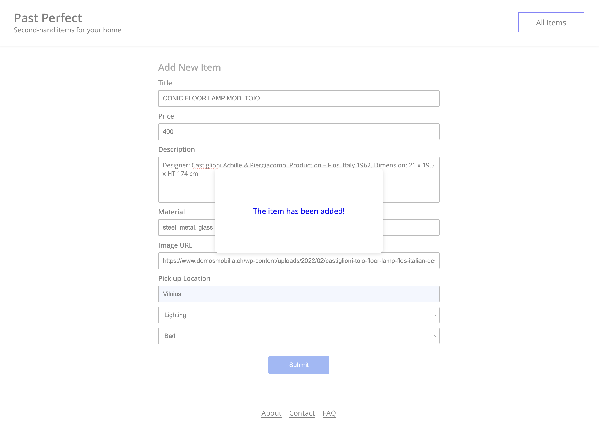
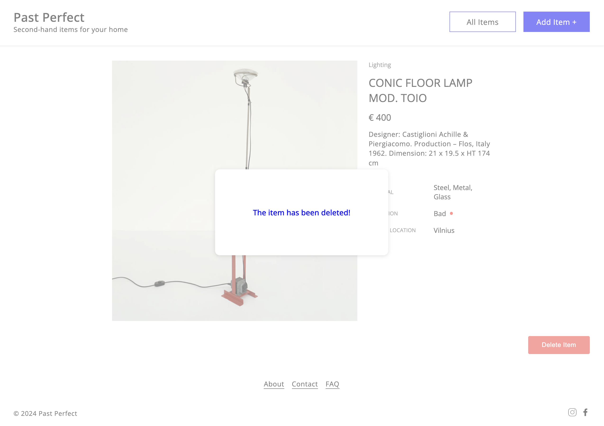

# Past Perfect – HTML, CSS & JavaScript

**Past Perfect** is a responsive online marketplace for second-hand home items. This multi-page application allows users to browse listings, add new items through a form, filter items by category, and view item details. The site is built using semantic HTML, modular CSS, and modern JavaScript, and integrates with a mock API for dynamic data operations.

## Project Overview

This project simulates a minimal online marketplace for second-hand furniture and décor. It demonstrates front-end development fundamentals including dynamic DOM manipulation, form validation, asynchronous data handling (`fetch`), category-based filtering, responsive design, and basic client-side routing via query parameters.

The application consists of:

- A **homepage** that displays items and supports category-based filtering
- An **item detail page** for viewing full item information and deleting entries
- A **form page** for submitting new listings (with full client-side validation)
- Responsive navigation menus for desktop and mobile views

It interacts with [MockAPI](https://mockapi.io/) to simulate CRUD operations.

## Key Features

### HTML & CSS

- Semantic HTML5 structure with accessible, readable markup
- Mobile-first, responsive layout using CSS media queries
- Modular and maintainable CSS using consistent class naming conventions
- Flexbox and Grid for adaptive layout structuring
- Styled UI components: filters, buttons, hover states, and a mobile burger menu

### JavaScript Functionality

- Dynamic item rendering via fetch from a MockAPI backend (GET, POST, DELETE)
- Category-based filtering with real-time DOM updates
- Form submission with custom client-side validation and user feedback (error/success messaging)
- Item detail routing via query string parameters
- Mobile menu toggle using event listeners and class manipulation
- Item deletion with visual confirmation and redirect

> No frameworks, libraries, or build tools were used. This project runs entirely on the client side using HTML, CSS, and vanilla JavaScript.

## Technologies Used

- HTML5
- CSS3
- JavaScript (ES6+)
- MockAPI (REST API for item CRUD)
- Google Fonts

## Screenshots

## Screenshots

### Homepage (Desktop View)


### Homepage (Mobile View)


### Category Filtering


### Item Detail Page


### Add Item Form


### Form Submitted Successfully



### Form Validation Error


### Item Deletion Confirmation



## Getting Started

To preview the project locally:

1. Clone the repository:

   ```bash
   git clone https://github.com/JustinaVilcinskaite/past-perfect-html-css-js.git
   ```

2. Navigate to the project directory:

   ```bash
   cd past-perfect-html-css-js
   ```

3. Open `index.html` in your preferred browser.

> **Note on Data**  
> This project uses [MockAPI](https://mockapi.io/) as a mock backend for demonstration purposes.  
> The data is publicly accessible and may be changed or deleted by others during testing.  
> Please do not treat this as a secure or private data source.

## Project Structure

```
past-perfect/
├── assets/                # Icons
│   └── screenshots/       # UI screenshots for documentation
├── form/                  # Add-item form page (HTML, JS, CSS)
│   ├── form.html
│   ├── form.js
│   └── form.css
├── item/                  # Item detail page (HTML, JS, CSS)
│   ├── item.html
│   ├── item.js
│   └── item.css
├── utils/                 # Reusable JavaScript utilities (fetch, validation)
│   ├── fetches.js
│   └── form-validation.js
├── index.html             # Homepage (item listing and filtering)
├── script.js              # Homepage logic
├── style.css              # Homepage styling
└── README.md              # Project documentation
```
